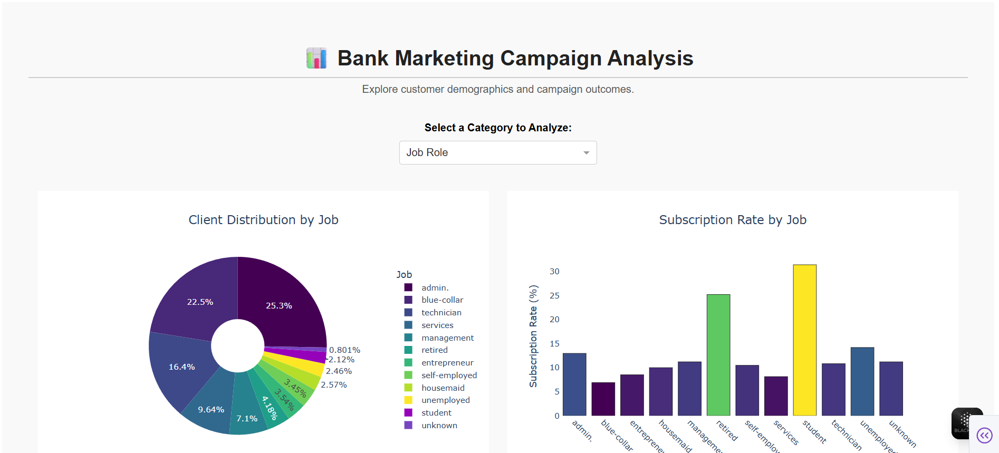

# Marketing Campaign Outcome Analysis

Build a business-aligned, recall-optimized predictive model and interactive dashboard to explore outcomes of a direct marketing campaign using Python and Plotly Dash.

---

## 📌 Project Overview

Financial institutions often run targeted campaigns but struggle to convert contacts into subscribers due to a lack of actionable insights and realistic modeling. This project tackles that challenge by combining data analysis, statistical testing, interpretable machine learning, and dashboard design to support informed decision-making.

---

## 💡 Problem Statement

The goal is to predict whether a customer will subscribe to a term deposit (`y`) based on their demographic and contact history. Common pitfalls in such projects include:

- **Over-reliance on leaky features** like call duration that aren’t known at prediction time.
- **Lack of explainability**, making model results hard to trust or act on.
- **Ineffective segmentation**, missing out on high-performing customer micro-groups.

This project addresses those through rigorous preprocessing, interpretable modeling, and interactive data exploration.

---

## 🛠️ Tools & Technologies

- **Python (Pandas, Scikit-learn):** Data cleaning, encoding, modeling, evaluation
- **Statistical Testing:** Chi-squared, Mann-Whitney U, Cramér’s V
- **SHAP:** Explainable AI for feature impact
- **Plotly Dash:** Interactive dashboard with live visual updates

---

## 🔍 Key Steps

### ✅ Data Preparation
- Cleaned and normalized data (41K rows, UCI Bank Marketing Dataset)
- Engineered meaningful features like `was_contacted_previously` from `pdays`
- Prevented leakage by removing `duration` before model training
- Applied stratified train-test split and scaling

### 📊 Statistical & EDA Analysis
- Validated categorical-numeric associations via Chi-squared & Mann-Whitney U tests
- Ranked categorical predictors using **Cramér’s V** (top: `job`, `contact`)
- Plotted interaction effects (e.g., `job` × `contact`)
- Identified seasonal performance trends (Spring/Fall peaks)

### 🤖 Predictive Modeling Pipeline
- Compared Logistic Regression, Random Forest, SVC, and XGBoost
- Selected **Logistic Regression** for highest **recall** (aligned with business needs)
- Tuned hyperparameters via `GridSearchCV` optimizing for **recall**
- Explained predictions using **SHAP summary and force plots**

---

## 📈 Interactive Dashboard

Built with **Plotly Dash**, the dashboard features:

- Dropdown menu to choose a categorical variable (`job`, `education`, etc.)
- Pie chart showing customer distribution for that variable
- Bar chart showing **subscription rates** per subcategory
- Responsive callbacks for a smooth user experience

---

## 🎯 Key Outcomes

- Built a realistic, high-recall classifier suitable for **lead generation**
- Delivered statistical insights into campaign performance drivers
- Deployed an **interactive dashboard** for exploratory marketing analysis
- Gained hands-on experience with model interpretability and data storytelling

---

## 🚀 How to Use

1. Clone this repository  
2. Run `app.py` to launch the dashboard  
3. Explore insights via the dropdown-linked visualizations  
4. Check the directory for full EDA, modeling, and SHAP explanations, alomg with the Insights & Recommendations.

---

## 📁 Dataset

- Source: [UCI Bank Marketing Dataset](https://www.kaggle.com/datasets/jiraleelas/uci-bank-marketing-full-dataset)
- Size: ~41,000 rows of customer profiles and campaign outcomes
  
---

## 🧠 Learnings & Reflections

- Preventing data leakage (via feature elimination) is crucial for honest modeling
- SHAP enables **business-aligned storytelling** of ML predictions
- Precision-recall trade-offs must be **driven by business goals**, not just accuracy

---
## 📄 License

This project is licensed under the [MIT License](LICENSE).

---

## 📬 Contact

Naman Kumar

📧 Email: namankr24@gmail.com

🔗 GitHub: NamanKr24
